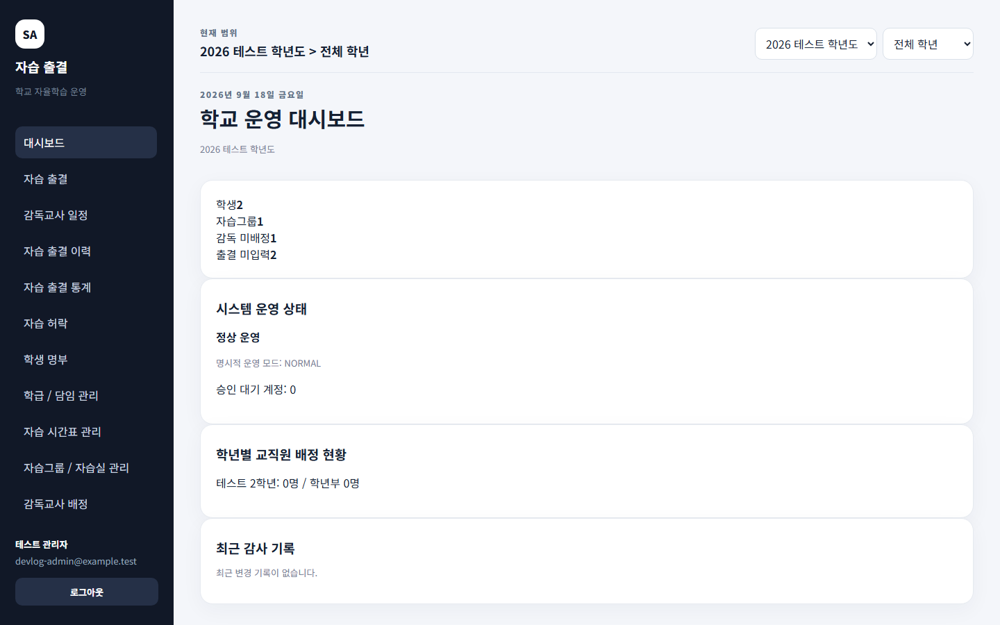
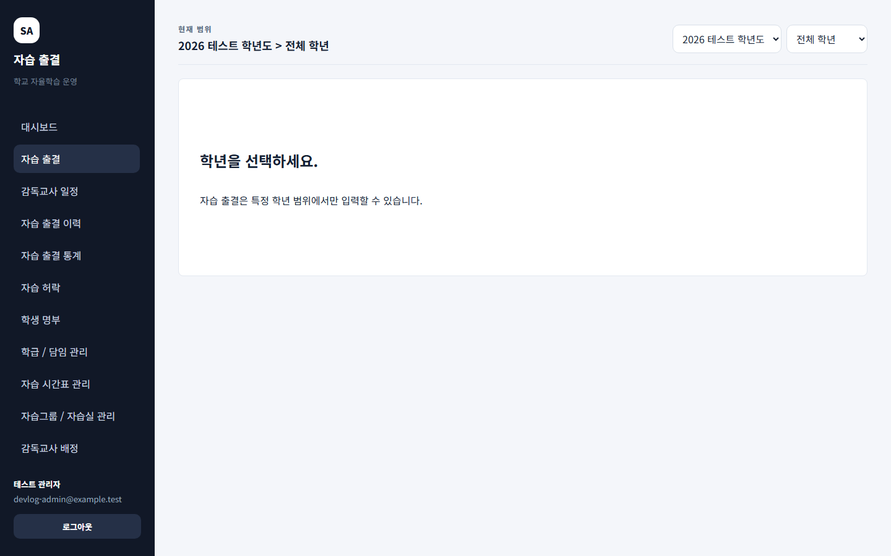
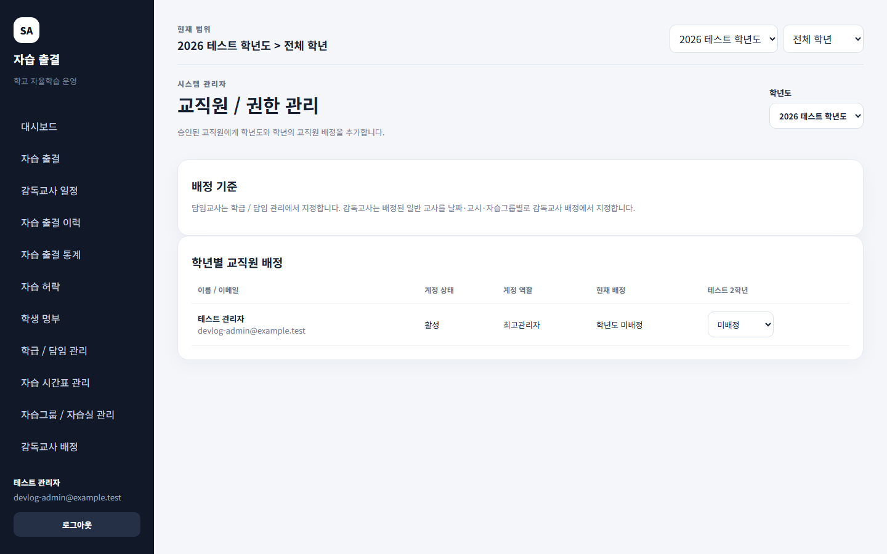
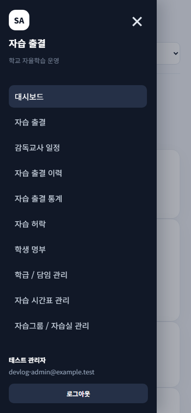

# [개발일지] 자습 출결관리 프로그램 - 운영 화면과 출결 관리 흐름 개선

카테고리: 개발일지  
태그: 자습출결관리, 출결관리, React, Firestore, 개발일지

## 개발 목표

자습 출결관리 프로그램의 운영 화면과 출결 관리 흐름을 정리하고, 관리자와 교사가 필요한 정보를 더 자연스럽게 확인할 수 있도록 화면 구성을 개선했습니다.

## 개발 배경

자습 출결 입력뿐 아니라 감독교사 일정, 출결 이력과 통계, 학년·학급 관리까지 이어지는 운영 흐름을 하나의 서비스 안에서 확인할 수 있도록 화면 구조와 탐색 흐름을 점검했습니다.

## 주요 변경사항

자습 출결 화면에서는 날짜·학급·자습그룹·교시·학생 조건을 기준으로 출결을 확인할 수 있도록 구성했습니다.

교직원과 권한 관리 화면에서는 학년도와 학년 범위에 따라 교직원 역할과 배정 상태를 관리할 수 있도록 정리했습니다.

## 반응형 UI 확인

작은 화면에서도 주요 메뉴에 접근할 수 있도록 모바일 사이드바 동작을 확인했습니다.

## 문제와 해결 과정

날짜가 바뀌는 시점의 조회 범위와 출결 입력 조건이 혼동되지 않도록 날짜 초기화와 필터 흐름을 점검했습니다. 또한 Firestore 규칙 테스트를 통해 조회와 변경 권한이 의도한 범위에서 동작하는지 확인했습니다.

## 결과 및 검증

기존 테스트와 빌드를 실행해 화면 및 데이터 흐름 변경이 기존 기능을 깨뜨리지 않는지 확인했습니다. 일부 감독교사 일정·통계 캡처 자료는 화면 준비 검증을 통과하지 못해 게시 자료에서 제외했습니다.

## 다음 개발 계획

감독교사 배정, 내 감독 일정, 출결 통계 화면의 테스트 캡처 환경을 추가로 점검할 예정입니다.

## 개발하면서 배운 점

운영 화면은 기능을 추가하는 것뿐 아니라 사용자가 현재 범위와 상태를 바로 이해할 수 있도록 탐색 구조와 검증 흐름을 함께 설계해야 한다는 점을 배웠습니다.

## 게시 전 확인

- 첨부 이미지 4장의 개인정보 및 내부 운영 정보 포함 여부 확인
- 네이버 카테고리와 태그 최종 확인
- 03~05 화면은 이번 게시 패킷에 포함하지 않음
- 발행 버튼은 직접 확인 후 수동으로 실행
